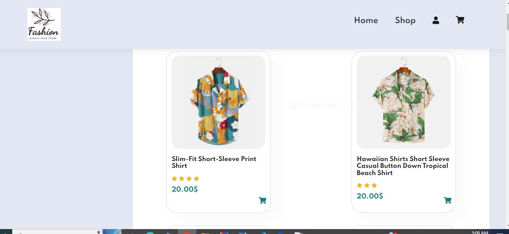
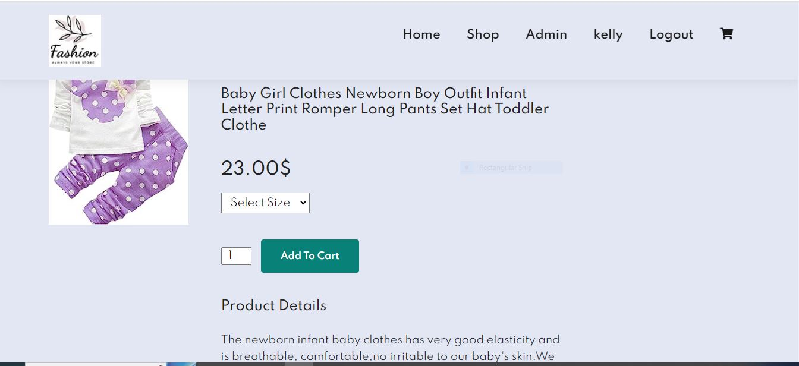

# JavaCaseStudy2024
Project

Creating a fashion store with Spring Boot, Spring Security, and Java involves building a web application that provides authentication, authorization, and features related to the fashion domain.

Pages  for the application

Login/ Registration Page
Utilize Spring Security to implement user authentication and authorization.
Support user registration, login, and logout functionalities.
Role-based access control to secure different parts of the application

Home and Search Page
Implement search functionality to allow users to find products based on keywords.
Each product should have details like name, description, price, and images.
Product Details Page

Display description of  selected product.
Each product should have details like name, description, price, and images.
Users can add product to their shopping cart

Check out page
     Support functionalities like updating quantities and removing items from the cart.

Order Status page
     Provide order confirmation with details such as order number, items, and total cost.

Admin Page to manage products
Implement an admin panel accessible only to users with administrative roles.
Admins can manage products, view and process orders.

User details editing page
Registered users can have profiles with order history.

Database tables

1. order table

2. product table

3.User table

4.order details table

5.User role table

6.Cart Table

7.productDetails Table

